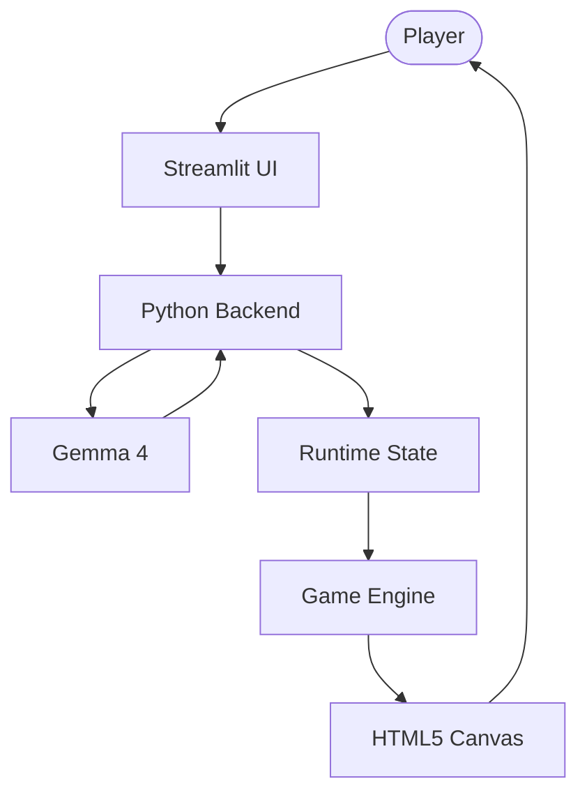
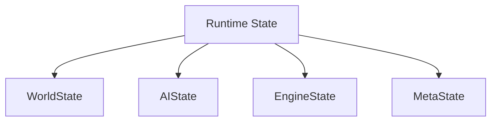
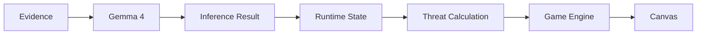
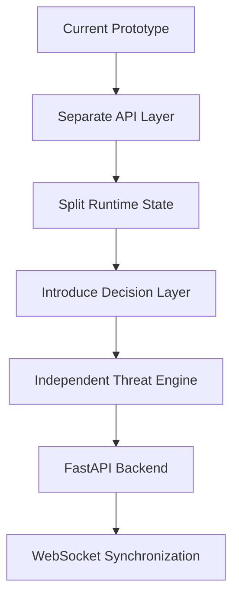

# Live System　

## Overview　

このドキュメントは、現在実装されている **Inference Collapse** のシステム構成を示します。

`architecture.md` が理想アーキテクチャを説明する設計書であるのに対し、このファイルは **現在実際に動作しているシステム** を記録することを目的としています。

---

# Current Runtime Architecture

現在は **Python Backend** がシステム全体のハブとして機能しており、LLM・状態管理・ゲームエンジンを仲介しています。

---

# Current Components

## UI

### Technology

* Streamlit
* HTML Components

### Responsibilities

* Evidence Input
* Audit Interface
* Status Display
* Game Launch

---

## Python Backend

### Responsibilities

* LLM 呼び出し
* 状態更新
* ゲームエンジン制御
* UI との連携

> 現在は API Layer を兼ねています。将来的には FastAPI へ分離予定です。

---

## LLM

### Model

* Gemma 4

### Responsibilities

* Analyze Evidence
* Detect Contradictions
* Calculate Confidence
* Estimate Threat Level

---

## Runtime State

現在は Python メモリ上で状態を保持しています。

### Current State

* Audit Results
* Node Truths
* AI Reasoning
* Threat Level

### Planned Structure

---

## Game Engine

### Responsibilities

* Player Movement
* Enemy AI
* Collision Detection
* Timer
* Vision System
* Glitch Effects

Threat Level を参照しながらゲーム世界を更新します。

---

## Rendering

### Technology

* HTML5 Canvas
* JavaScript

### Responsibilities

* Player Rendering
* Enemy Rendering
* HUD
* Visual Effects

---

# Current Runtime Flow

---

# Current Limitations

現在のプロトタイプには以下の課題があります。

* Streamlit とゲームロジックが密結合
* Runtime State の責務が集中している
* API Layer が未分離
* Decision Layer が未実装
* FastAPI 化を前提とした構造になっていない

---

# Planned Refactoring

---

# Related Documents

| Document          | Purpose                       |
| ----------------- | ----------------------------- |
| `README.md`       | Project Overview              |
| `architecture.md` | Target Architecture           |
| `flow.md`         | Runtime Data Flow             |
| `docs/adr/`       | Architecture Decision Records |

---

# Status

**Current Phase**

Prototype

現在は **「動くプロトタイプから理想アーキテクチャへ段階的に移行するフェーズ」** にあります。
