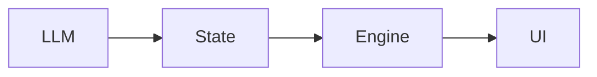
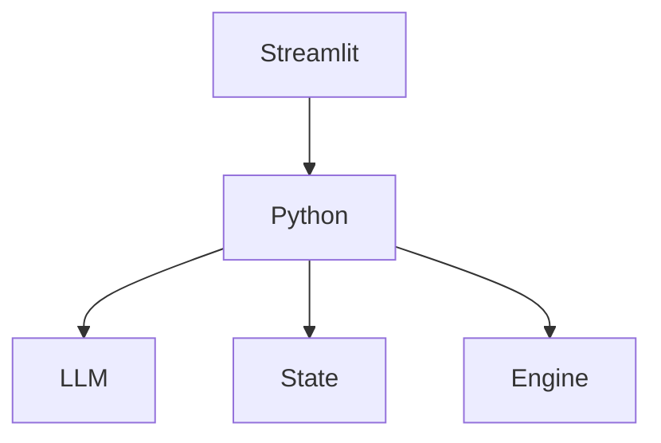
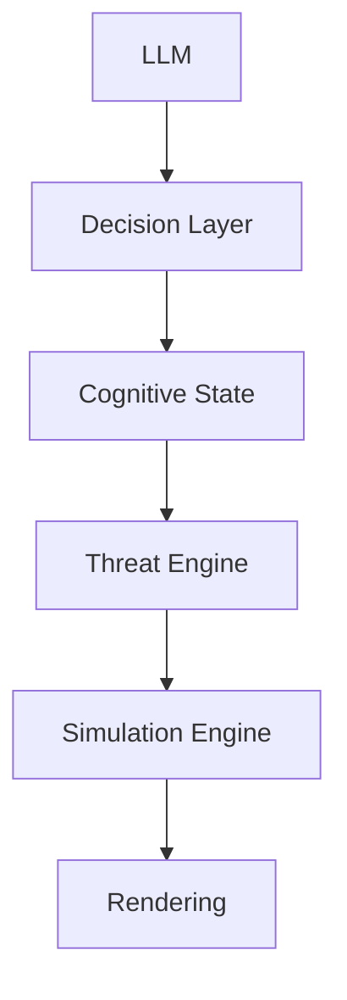
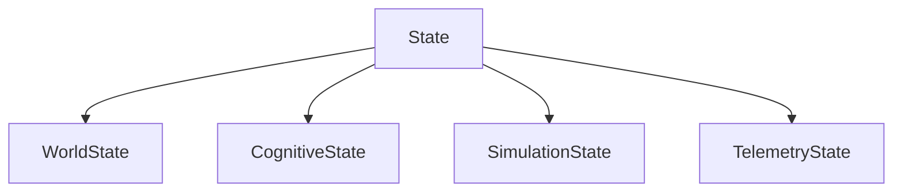
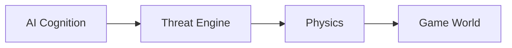

# Architecture Evolution

## プロトタイプからアーキテクチャへの進化

このドキュメントは、本プロジェクトのアーキテクチャがどのような設計判断を経て現在の形へ進化したかを記録する。

本プロジェクトは、最初から完成された設計を目指したものではない。

**動作するプロトタイプを先に構築し、その後に構造を抽出・再設計する**という段階的なアプローチを採用している。

---

# 1. 出発点：制約付きプロトタイピング

開発当初はコンテスト期間という明確な制約が存在した。

この段階で最も重要だったのは、

**「AIが世界を書き換える体験を成立させること」**

であり、設計の美しさではなかった。

そのため、以下の方針を意図的に採用した。

* LLMの出力をゲームへ即座に反映する
* UI・AI・ゲームロジックを分離しない
* 最短距離で動作するデモを完成させる

つまり、

**Prototype First**

という思想を優先した。

---

# 2. 初期アーキテクチャ

初期構造は非常に単純だった。



この構造により、

* AIが世界を変える体験
* リアルタイム推論
* ゲームプレイ

を短期間で実現できた。

しかし、この構造は長期的には大きな課題を抱えていた。

---

# 3. 顕在化した問題

## 3.1 LLMとゲームロジックの密結合

LLMの出力がそのままゲーム世界へ反映されるため、

* 再現性が低い
* デバッグが難しい
* ノイズとロジックの境界が曖昧

という問題が発生した。

---

## 3.2 Stateの肥大化

すべての情報が単一の State に集約されていた。

```text
State
├── World
├── AI Result
├── Threat
├── Engine Data
├── UI State
└── Logs
```

その結果、

* 責務が不明確
* 修正の影響範囲が広い
* スケールしない

という典型的な「神オブジェクト問題」が発生した。

---

## 3.3 Threat System の責務が曖昧

Threat System はゲーム上では機能していたが、

* 難易度制御
* 演出
* 物理法則

という複数の役割を同時に担っていた。

設計上、

**「何を担当する層なのか」**

が説明できない状態だった。

---

## 3.4 レイヤー分離の欠如

初期構造では、



のように、Python Backend がすべてを制御していた。

この構造では、

* 変更の影響範囲が大きい
* モジュール単位でのテストが困難
* 将来的な FastAPI 化が難しい

という問題があった。

---

# 4. ボトルネック

分析の結果、最も大きなボトルネックは以下の2点だった。

## State が境界になっていない

本来 State は「世界の記録」を担当すべきだが、

実際には、

* AI
* Engine
* UI

すべてが直接 State を操作していた。

つまり、

State が共有メモリとなり、設計上の境界として機能していなかった。

---

## LLM が直接世界を書き換えていた

本来、

LLMは「認知」を担当する存在である。

しかし初期設計では、

LLMが直接ゲーム世界を書き換えていた。

その結果、

AIの認知とゲーム世界が強く結合し、

責務の分離が失われていた。

---

# 5. 採用した解決策

プロトタイプを維持しながら、責務を段階的に分離した。



この構造では、

Decision Layer が LLM 出力を正規化し、

Threat Engine が認知状態を物理法則へ変換する。

---

# 6. State の再構造化

State は責務ごとに分割する。



これにより、

各データの意味が明確になり、

依存関係を最小化できる。

---

# 7. Threat Engine の再定義

Threat Engine は難易度調整ではない。

役割は、

**「AIの認知状態をゲーム世界の物理法則へ変換すること」**

である。

| AI State      | Physics           |
| ------------- | ----------------- |
| Confidence    | Enemy Speed       |
| Severity      | Spatial Noise     |
| Contradiction | Visual Distortion |
| Hallucination | Field of View     |

Threat Engine は、

認知と物理世界を接続する変換層として位置付けられる。

---

# 8. 検討した代替案

設計検討の過程では、以下の案も存在した。

### ① LLM が直接ゲームを制御する

```text
LLM → Game Engine
```

採用しなかった理由

* デバッグ不能
* 再現性が低い
* AIの出力にゲーム全体が依存する

---

### ② State を一つの巨大オブジェクトとして管理する

採用しなかった理由

* 神オブジェクト化
* 拡張性が低い
* 責務が曖昧になる

---

### ③ Engine 内で Threat を計算する

採用しなかった理由

Threat が物理演算と結合してしまい、

設計上の意味が失われるため。

---

# 9. 設計思想の変化

最も大きな変化は、

**「AIがゲームを動かす」**

という考え方から、

**「AIの認知状態を物理モデルへ変換する」**

という考え方へ移行したことである。



---

# 10. 結論

本プロジェクトは、

最初から完成されたアーキテクチャではない。

制約下で成立したプロトタイプを分析し、

責務を整理し、

意味を与え、

段階的にアーキテクチャへ昇華させてきた。

本プロジェクトの価値は、

**「動くものを作ること」だけではなく、**

**「動くものから設計を抽出し、再構築するプロセスそのもの」**

にある。
