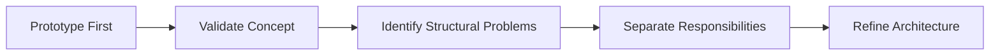

# Problem Statement

## Why the Prototype Needed Refactoring

## Overview

Inference Collapse was originally developed under a strict time constraint as a working prototype.

The primary objective was **not to build a perfect software architecture**, but to validate a new concept:

> **Can an LLM's cognitive state directly influence a real-time game world?**

To answer this question quickly, the initial implementation intentionally prioritized **rapid experimentation** over architectural separation.

---

# Initial Design Goals

The first prototype focused on three goals:

* Validate that LLM inference could affect gameplay in real time.
* Build a complete interactive experience as quickly as possible.
* Observe whether "AI cognition becomes game mechanics" was technically feasible.

This resulted in a highly integrated architecture:

```text
LLM
    ↓
JSON Output
    ↓
Runtime State
    ↓
Game Engine
    ↓
UI
```

Although this architecture would not be considered ideal for long-term development, it successfully demonstrated the core concept.

---

# Structural Problems Identified

Once the prototype became functional, several architectural limitations became apparent.

## 1. Tight Coupling Between LLM and Game Logic

LLM outputs directly influenced the simulation.

This approach enabled rapid experimentation but introduced several problems:

* Low reproducibility
* Difficult debugging
* Unclear separation between AI uncertainty and deterministic game logic

The simulation became dependent on inherently non-deterministic LLM responses.

---

## 2. State Becoming a God Object

Runtime state gradually accumulated multiple responsibilities:

* World state
* AI reasoning
* Physics state
* Runtime logs

As a result:

* Dependencies became difficult to understand.
* Changes affected unrelated systems.
* Scalability decreased.

This is a classic example of the **God Object** anti-pattern.

---

## 3. Ambiguous Role of the Threat System

The Threat System functioned correctly, but its architectural responsibility was unclear.

It simultaneously acted as:

* Difficulty adjustment
* Visual effects controller
* Physics modifier

Because these concerns were mixed together, the purpose of the module became difficult to explain and maintain.

---

## 4. Tight Coupling Between UI, Engine, and AI

The prototype directly connected:

* Streamlit
* JavaScript
* Canvas
* Python backend
* LLM inference

While this minimized development time, it also caused:

* High coupling
* Large change impact
* Limited extensibility

---

# Root Cause

These issues were **not implementation mistakes**.

They were the natural consequence of intentionally choosing an integrated prototype architecture.

The trade-off was explicit:

* Prioritize speed
* Validate the concept
* Refactor later

Rather than optimizing for maintainability from the beginning.

---

# Design Strategy

The project therefore follows a staged architecture process:



Instead of attempting to design a complete architecture before implementation, the architecture is extracted from a working system.

---

# Planned Improvements

The refactoring roadmap includes:

* Introduce a dedicated Decision Layer
* Split Runtime State into specialized state objects
* Redefine the Threat System as a physics transformation layer
* Separate API from the frontend
* Decouple the simulation engine from the UI

These changes transform the prototype into a modular, maintainable architecture while preserving the original concept.

---

# Conclusion

The architectural issues observed in the prototype are **not defects**, but expected consequences of a deliberate engineering trade-off.

The prototype successfully validated the central idea:

> **LLM cognition can be transformed into game-world dynamics.**

The current architecture work is therefore not a redesign from failure, but the evolution of a successful prototype into a maintainable software architecture.
