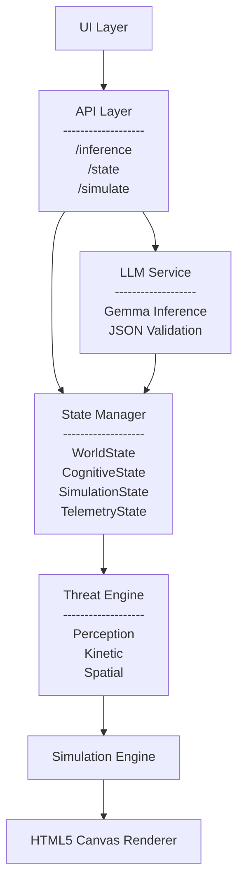

# Final Architecture（再設計版）

## Overview

コンテスト提出版では、**「Gemma 4 の推論結果をリアルタイムにゲームへ反映する」**というアイデアを、最短で実現することを優先しました。

そのため、AI・状態管理・ゲームロジック・UI は密結合な構造となっており、プロトタイプとしては十分に機能した一方で、継続的な開発や機能追加を考えると責務の境界が曖昧になるという課題が見えてきました。

そこで本プロジェクトでは、**動作するプロトタイプを維持したまま、意味単位で責務を分離するアーキテクチャへ再設計**を行いました。

目的は単なるコード整理ではなく、

* AI
* 状態管理
* シミュレーション
* UI

を独立して進化できる構造へ移行することです。

---

# Final Architecture



---

# Layer Responsibilities

## LLM Service

### Responsibility

Gemma は**推論だけ**を担当します。

入力された証拠から、

* Report
* Confidence
* Severity
* Contradiction

を生成します。

### Design Principle

Gemma 自身はゲーム世界を書き換えません。

AI は**世界を制御する存在**ではなく、

**世界を解釈するコンポーネント**

として設計されています。

---

## State Manager

### Responsibility

LLM の出力を直接ゲームへ渡さず、一度 State Manager が受け取ります。

状態は責務ごとに分離されます。

```text
State Manager

├── WorldState
├── CognitiveState
├── SimulationState
└── TelemetryState
```

### Benefits

* デバッグしやすい
* 状態の追跡が容易
* 将来的な永続化に対応しやすい
* 各レイヤーの責務が明確になる

---

## Threat Engine

### Responsibility

本プロジェクトでもっとも重要なレイヤーです。

LLM の認知情報を、ゲーム世界の物理法則へ変換します。

### Transformation Rules

| Cognitive State | Physical Effect               |
| --------------- | ----------------------------- |
| Confidence      | Kinetic Amplification（敵速度）    |
| Severity        | Spatial Instability（空間ノイズ）    |
| Contradiction   | Perception Distortion（視界・FOV） |

この設計により、

**AIがゲームを動かす**

のではなく、

**AIの認知状態が世界の物理法則へ変換される**

という、本システム独自のアーキテクチャを実現しています。

---

## Simulation Engine

### Responsibility

Simulation Engine は Threat Engine が生成した物理パラメータだけを受け取り、

* Enemy AI
* Player
* Collision
* Timer
* Vision
* Effects

を更新します。

### Design Principle

Simulation Engine は

* Gemma の存在を知らない
* State の内部構造を知らない

という設計になっています。

そのため、

LLM が Gemma から他モデルへ変更されても、

ゲームロジックを修正する必要はありません。

---

## UI Layer

### Responsibility

UI は現在の世界状態を描画することだけを担当します。

具体的には、

* Streamlit UI
* HTML5 Canvas
* HUD
* Status Panel

などを管理します。

### Design Principle

UI は

* AI 推論
* ゲームロジック
* 状態管理

へ直接介入しません。

そのため、

* フロントエンド変更
* Canvas の置き換え
* UI デザイン変更

を他レイヤーへ影響させず実施できます。

---

# Design Improvements

今回の再設計では、「コードを分割すること」自体が目的ではありません。

目的は、

**AI・状態管理・ゲームロジック・UI の責務を明確に分離し、それぞれを独立して進化できる構造へ移行すること**です。

この設計により、

* LLM の差し替え
* FastAPI によるバックエンド分離
* WebSocket を用いたリアルタイム同期
* マルチプレイヤー対応
* 推論キャッシュ
* 非同期推論
* リプレイ機能
* 推論ログ解析
* Telemetry の可視化

といった拡張を、既存コードへの影響を最小限に抑えながら実装できます。

---

# Design Philosophy

この再設計で最も重要なのは、

**AI がゲームを直接制御するのではなく、AI の認知状態を物理モデルへ変換すること**です。

つまり、本システムは

```
LLM
      ↓
Cognitive State
      ↓
Threat Engine
      ↓
Physics
      ↓
Simulation
      ↓
Rendering
```

という一方向のデータフローを持ちます。

各レイヤーは明確な責務を持ち、他レイヤーの内部実装を知らないことで、保守性・拡張性・再利用性を高めています。

---

# Conclusion

この Final Architecture は、プロトタイプで得られた知見を基に再設計された、将来的なプロダクト運用を見据えた構造です。

最終的な目標は、

**「AI の認知状態を、安全かつ制御可能な形でゲーム世界の物理法則へ変換するアーキテクチャ」**

を実現することにあります。
