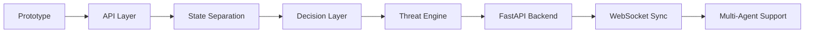

# Future Work

## Overview

Inference Collapse は、コンテスト向けプロトタイプとして
「LLM の認知状態がゲーム世界へ影響を与える」というコアコンセプトの実証を目的として開発された。

現在の実装はこのコンセプトを実現しているが、
今後はより拡張性・保守性・再利用性を備えたアーキテクチャへ発展させることを目標としている。

---

# Planned Architecture Evolution



---

# Planned Improvements

## 1. API Layer Separation

現在は Streamlit とバックエンドが密結合している。

今後は API を明確に分離し、

- `/inference`
- `/state`
- `/simulate`

を中心とした構成へ移行する。

---

## 2. State Refactoring

現在の Runtime State を責務ごとに分離する。

```text
State
├── WorldState
├── CognitiveState
├── SimulationState
└── TelemetryState
```

これにより、

- デバッグ性
- テスト容易性
- 永続化

を向上させる。

---

## 3. Decision Layer

LLM の出力を直接ゲームへ渡さず、
意味を持つゲームパラメータへ変換する層を導入する。

例：

| LLM Output | Physics Parameter |
|------------|-------------------|
| Confidence | Enemy Speed |
| Severity | Spatial Distortion |
| Contradiction | Perception Distortion |

これにより、
AI モデルを変更してもゲームロジックを維持できる。

---

## 4. Independent Threat Engine

Threat Engine を独立したモジュールとして実装する。

役割は、

**AI の認知状態を物理法則へ変換すること**

のみとする。

---

## 5. Backend Modernization

現在の Python 実装を FastAPI ベースへ移行する。

期待される効果：

- REST API
- 非同期推論
- マルチクライアント対応
- テスト容易性

---

## 6. Real-Time Synchronization

WebSocket により

- ゲーム状態
- 推論結果
- イベント

をリアルタイム同期する。

---

## 7. Multi-Agent Architecture

将来的には複数の LLM を同時に動作させることを想定している。

例：

- Investigator Agent
- Adversary Agent
- Observer Agent

それぞれが独立した認知状態を持ち、
同一世界へ影響を与える構成を検討している。

---

## 8. Telemetry & Replay

推論結果とゲーム状態を記録し、

- リプレイ
- デバッグ
- 推論比較
- 説明可能性（Explainability）

へ活用する。

---

# Long-Term Vision

本プロジェクトの目的は、
単なるゲームを開発することではない。

目指しているのは、

**「AI の認知状態がどのように世界の振る舞いへ変換されるか」を観測・実験できるプラットフォーム**

である。

そのため今後も、

- AI
- State
- Physics
- UI

を独立したコンポーネントとして発展させながら、
新しい推論モデルやゲームシステムへ適用可能なアーキテクチャを目指す。
