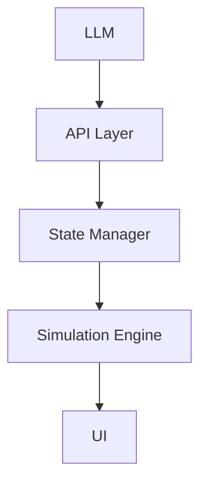
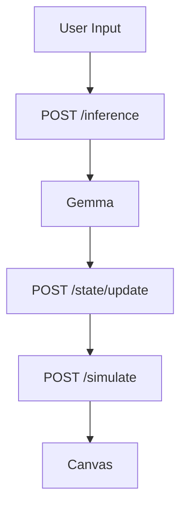
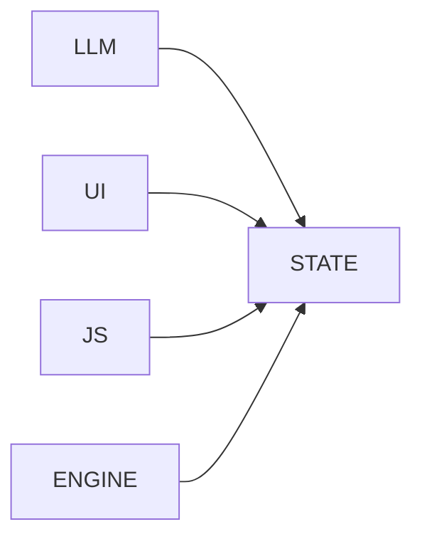

思考のメモ・なぜそう使うったか

ーーーーーーーーーーーーーーーーーーーーーーーーーーーーーーーー

# Design Notes

## 思考メモ・設計の経緯（Why This Architecture Exists）

---

# AI Cognitive World Engine

## 概要

本プロジェクトは、

**「AIの認知状態（確信度・幻覚・危険度）が、そのままゲーム世界の物理法則を変える」**

というコンセプトを持つ実験的シミュレーションシステムです。

一般的なゲームでは、難易度はあらかじめ設定された固定パラメータによって決定されます。

本システムでは、LLMの推論結果そのものが世界の状態を変化させます。

つまり、

```
AIの認知状態
      ↓
世界の物理法則
      ↓
ゲーム体験
```

という構造を持っています。

---

# 設計思想

このシステムは単なるゲームではありません。

目的は、

**AI・状態管理・物理演算・UIを明確に分離し、それぞれの責務を独立させること**

です。

設計上の目標は次の4点です。

* AIが世界へ影響を与える構造を検証する
* Stateの肥大化（God Object）を防ぐ
* 非決定的なAI推論とリアルタイムゲームを分離する
* 再現可能で拡張しやすいアーキテクチャを構築する

---

# システム全体像



AIは直接ゲーム世界を操作しません。

一度 **State Manager** に状態を書き込み、その状態を **Simulation Engine** が読み取ることで世界を更新します。

---

# 1. LLM Layer（認知・推論）

AIの頭脳に相当する層です。

## 役割

* 証拠から推論を行う
* 危険度を評価する
* 矛盾を検出する
* 幻覚を含む認知状態を生成する

### Input

```json
{
  "sector":"BIO",
  "evidence":"..."
}
```

### Output

```json
{
  "report":"...",
  "confidence":0.85,
  "severity":0.70,
  "contradiction":false
}
```

---

# 2. State Manager

ゲーム全体の状態を管理する唯一の場所です。

## 役割

* AI推論結果の保存
* 世界状態の管理
* 履歴・ログの保持

状態は用途別に分離します。

```text
State

├── WorldState
├── AIState
├── EngineState
└── MetaState
```

### この分離が必要な理由

状態を一つの巨大なオブジェクトにまとめると、

* God Object化
* デバッグ困難
* 依存関係の増加

が発生します。

---

# 3. Simulation Engine

リアルタイムで動作するゲームエンジンです。

## 担当

* プレイヤー
* 敵AI
* マップ
* 時間
* 衝突判定

この層はAIを直接呼び出さず、Stateのみを参照します。

---

# 4. Threat System（本システムの核）

このシステム最大の特徴です。

AIの認知状態をゲーム世界の物理法則へ変換します。

| AI State      | Physics       |
| ------------- | ------------- |
| Confidence    | Enemy Speed   |
| Severity      | Glitch        |
| Hallucination | Field of View |
| Contradiction | Entropy       |

つまり、

**難易度 = 固定値**

ではなく、

**難易度 = AIの認知状態**

となります。

---

# 5. UI Layer

プレイヤーが操作するインターフェースです。

構成要素

* Streamlit
* HTML5 Canvas
* Status Panel
* Control Buttons

UIは表示と入力のみを担当し、ゲームロジックは持ちません。

---

# データフロー



---

# 現在の課題

現在はまだ試作段階であり、一部のコンポーネントが密結合しています。



この構造では、

* 各層が直接干渉する
* 保守性が低下する
* デバッグが難しくなる

という問題があります。

---

# 解決方針

## Stateの分離

```text
State

├── WorldState
├── AIState
├── EngineState
└── MetaState
```

---

## API境界の明確化

すべての通信をAPI経由に統一します。

```
POST /inference

POST /state/update

POST /simulate
```

これにより各コンポーネントは疎結合になります。

---

# Architecture Decisions

## なぜLLMとEngineを分離するのか

LLMは非決定的で実行時間も一定ではありません。

一方、ゲームエンジンはリアルタイムかつ決定的に動作する必要があります。

両者を直接接続すると、

* フレームレート低下
* 同期ずれ
* 再現性の欠如

が発生するため、Stateを介して接続します。

---

## なぜStateを中央管理するのか

LLMの出力を直接ゲームへ反映すると、

* デバッグ不能
* 状態追跡困難
* 依存関係の増加

を招きます。

一度Stateへ保存し、その状態をゲームエンジンが読み取る構造とすることで、責務を分離します。

---

# 今後の拡張

予定している改善項目です。

* FastAPIによるバックエンド分離
* Canvasフロントエンドの独立
* Multi-Agent LLM対応
* Cognitive State可視化
* WebSocketによるリアルタイム同期

---

# 本プロジェクトの定義

Inference Collapse はゲームではありません。

**「AIの認知が世界の物理法則へ変換される過程を観測する実験システム」**

です。

このプロジェクトの価値は完成度ではなく、

* AI認知と物理世界の結合
* 推論から物理法則への変換
* 動くプロトタイプから設計を抽出するプロセス

を示している点にあります。
