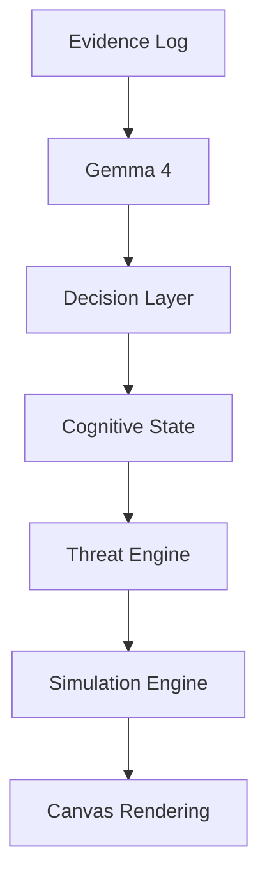

# Architecture

# Inference Collapse: Real-Time Hallucination Audit System

## Overview

**Inference Collapse** は、

**「LLMの認知状態がゲーム世界を書き換える」**

ことを目的とした実験的シミュレーションシステムです。

一般的な

```
LLM → Text Generation → UI
```

ではなく、

```
LLM → Cognitive State → Physics → World
```

という変換パイプラインを採用しています。

LLMは文章を生成するだけではなく、ゲーム世界を変化させる状態変数を生成します。

---

# Overall Architecture


システムは各レイヤーを責務ごとに分離し、State Managerを中心として疎結合に接続されています。

---

# Project Structure

```text
app.py

api/
 └── inference.py

services/
 └── gemma.py

state/
 ├── world_state.py
 ├── ai_state.py
 └── meta_state.py

engine/
 ├── threat.py
 └── simulation.py

ui/
 └── canvas.js

docs/
 ├── architecture.md
 ├── flow.md
 └── adr/
      ├── 001-separation-of-llm.md
      ├── 002-state-isolation.md
      └── 003-real-time-simulation.md
```

この構造により、

* LLM
* State
* Simulation
* UI

をそれぞれ独立した責務として管理できます。

---

# Component Responsibilities

## UI Layer

### Responsibility

* ユーザー入力
* Canvas描画
* HUD表示
* ステータス表示

### Should NOT

* AI推論
* ゲームロジック
* 状態管理

---

## API Layer

### Responsibility

* UIとバックエンドの橋渡し
* 推論API呼び出し
* 状態更新API

### Should NOT

* 描画
* シミュレーション
* AIロジック

---

## LLM Service

### Responsibility

* セキュリティログ解析
* 推論生成
* JSON構造化

### Output

```json
{
  "report": "...",
  "confidence": 0.87,
  "severity": 4,
  "contradiction": false
}
```

LLMは**真実生成装置**ではなく、

**認知状態生成器（Cognitive State Generator）**

として扱います。

---

## Decision Layer

### Responsibility

LLMの出力をゲームエンジンが扱える形式へ正規化します。

### Input

* confidence
* severity
* contradiction

### Output

* normalized confidence
* threat value
* entropy

この層を設けることで、LLMとゲームエンジンを直接結合しない設計になっています。

---

## State Manager

### Responsibility

ゲーム全体の状態を保持する唯一の管理層です。

### Managed States

* WorldState
* AIState
* MetaState

### Should NOT

* 描画
* AI推論
* 物理演算

Stateはゲーム全体の共有データとして利用されます。

---

## Threat Engine

### Responsibility

AIの認知状態をゲーム世界の物理法則へ変換します。

### Input

* confidence
* severity
* contradiction
* hallucination

### Output

* Enemy Speed
* Field of View (FOV)
* Detection Range
* Glitch Effect

このシステム最大の特徴であり、

**AIの認知状態が物理法則になります。**

---

## Simulation Engine

### Responsibility

ゲーム世界をリアルタイムに更新します。

### Controls

* Player
* Enemy AI
* Collision
* Physics
* Timer
* Environment

Threat Engineから渡された値のみを利用してゲーム世界を更新します。

---

## Rendering Layer

### Responsibility

現在の世界状態を描画します。

### Technology

* HTML5 Canvas
* JavaScript

担当するもの

* 視界
* HUD
* グリッチ演出
* エフェクト

---

# Data Flow

推論がゲームへ反映されるまでの流れです。



この流れにより、

**LLMの認知結果がゲーム世界へ反映されます。**

---

# Design Principles

本プロジェクトは以下の設計原則に基づいています。

## Prototype First

まず動くものを作り、

後から構造化します。

---

## Post-Hoc Architecture

最初に設計するのではなく、

**実装から設計を抽出する**

アプローチを採用しています。

---

## Inference-to-Physics Mapping

LLMの認知状態を、

ゲーム世界の物理法則へ変換します。

| LLM Output    | Physics       |
| ------------- | ------------- |
| Confidence    | Enemy Speed   |
| Severity      | Glitch Effect |
| Contradiction | Entropy       |
| Hallucination | FOV           |

---

# Design Goals

本システムの設計目標は以下です。

* Responsibility Separation（責務分離）
* Loose Coupling（疎結合）
* Replaceable LLM
* Replaceable Game Engine
* Replaceable UI
* Backend Migration Ready
* Scalable Architecture

---

# Future Extensions

今後予定している拡張です。

* Decision Layerの完全分離
* FastAPI Backend
* WebSocket同期
* Multi-Agent LLM
* Cognitive State Visualizer
* Save / Replay System

---

# Related Documents

| Document                          | Purpose          |
| --------------------------------- | ---------------- |
| `README.md`                       | プロジェクト概要         |
| `flow.md`                         | システム全体の処理フロー     |
| `adr/001-separation-of-llm.md`    | LLM分離の設計判断       |
| `adr/002-state-isolation.md`      | State管理の設計判断     |
| `adr/003-real-time-simulation.md` | リアルタイムシミュレーション設計 |

---

# Conclusion

Inference Collapse は単なるゲームではありません。

**LLMの認知状態をゲーム世界の物理法則へ変換する実験システム**です。

本プロジェクトでは、

* 推論から物理法則への変換
* 認知状態の可視化
* 後付けアーキテクチャ設計

を中核コンセプトとして設計されています。
