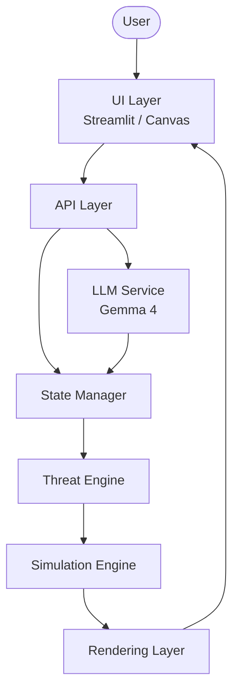
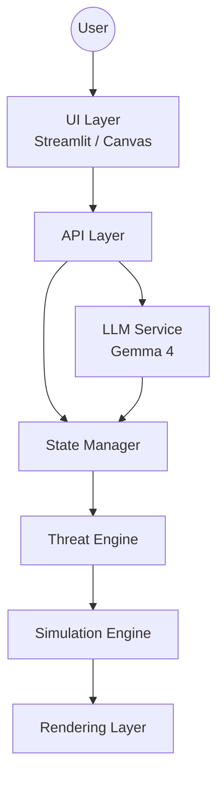
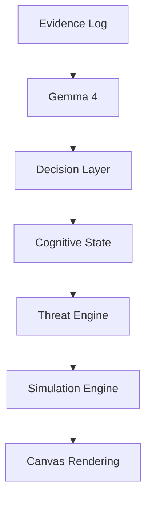

# Architecture

## Overview

**Inference Collapse** は、

**「LLMの認知状態がゲーム世界を書き換える」**

ことを目的とした実験的シミュレーションシステムです。

従来のように **LLMがテキストを生成して終わる** のではなく、

**LLM → 認知状態 → 物理法則 → ゲーム世界**

という変換パイプラインを持つことが、このシステムの最大の特徴です。

---

# Overall Architecture



各コンポーネントはそれぞれ独立した責務を持ち、**State Manager** を中心として疎結合に接続されます。

---

# Project Structure

```text
app.py

api/
 └── inference.py

services/
 └── gemma.py

state/
 ├── world_state.py
 ├── ai_state.py
 └── meta_state.py

engine/
 ├── threat.py
 └── simulation.py

ui/
 └── canvas.js

docs/
 ├── architecture.md
 ├── flow.md
 └── adr/
```

この構成により、

* AI
* 状態管理
* シミュレーション
* UI

が明確に分離されます。

---

# Component Responsibilities

## UI Layer

### Responsibility

* ユーザー入力
* ゲーム画面表示
* HUD表示

### Should NOT

* AI推論
* ゲームロジック
* 状態管理

---

## API Layer

### Responsibility

* UIとバックエンドの橋渡し
* 推論API呼び出し
* 状態更新API

### Should NOT

* 描画
* シミュレーション
* AIロジック

---

## LLM Service

### Responsibility

* ログ解析
* 推論生成
* JSON構造化

### Output

* report
* confidence
* severity
* contradiction

---

## State Manager

### Responsibility

ゲーム全体の状態を保持する唯一の管理層。

### Managed States

* WorldState
* AIState
* MetaState

### Should NOT

* 描画
* AI推論
* 物理演算

---

## Threat Engine

### Responsibility

AIの認知状態をゲームの物理法則へ変換する。

### Input

* confidence
* severity
* contradiction
* hallucination

### Output

* Enemy Speed
* Field of View (FOV)
* Glitch Effect
* Detection Range

---

## Simulation Engine

### Responsibility

ゲーム世界を更新する。

### Controls

* Player
* Enemy AI
* Collision
* Physics
* Timer

---

## Rendering Layer

### Responsibility

現在の世界状態を描画する。

### Technology

* HTML5 Canvas
* JavaScript

---

# Design Principles

本プロジェクトは以下の設計原則に基づいています。

* **Prototype First**
  まず動くものを作り、その後に構造化する。

* **Post-Hoc Architecture**
  実装から設計を抽出する。

* **Inference-to-Physics Mapping**
  LLMの認知状態をゲーム世界の物理法則へ変換する。

---

# Related Documents

| Document       | Purpose                             |
| -------------- | ----------------------------------- |
| `flow.md`      | システム全体の処理フロー                        |
| `adr/001-*.md` | 設計判断（Architecture Decision Records） |
| `README.md`    | プロジェクト概要                            |

# Architecture

## Inference Collapse: Real-Time Hallucination Audit System

Inference Collapse は、

**「LLMの認知状態がゲーム世界を書き換える」**

ことを目的とした実験的システムである。

一般的な

```
LLM → UI
```

ではなく、

```
LLM → 認知状態 → 物理法則 → ゲーム世界
```

という構造を採用している。

---

# 1. System Architecture

システム全体は以下の5層で構成される。



この図を見るだけで、

**「どこからどこへデータが流れるか」**

が理解できる。

---

# 2. Directory Structure

現在の理想構造は以下。

```text
app.py

api/
    inference.py

services/
    gemma.py

state/
    world_state.py
    ai_state.py
    meta_state.py

engine/
    threat.py
    simulation.py

ui/
    canvas.js

docs/
```

各ディレクトリは責務を明確に分離する。

---

# 3. Component Responsibilities

## UI Layer

### 役割

* ユーザー入力
* Canvas描画
* 状態表示

### 持たない責務

* AI推論
* ゲームロジック
* Threat計算

---

## API Layer

### 役割

UIとバックエンドの橋渡し。

将来的には FastAPI 化を想定。

### 持たない責務

* ゲーム描画
* AIロジック

---

## LLM Layer

Gemma 4 による推論を担当。

入力

* Evidence
* Security Logs

出力

```json
{
  "report":"...",
  "confidence":0.87,
  "severity":4,
  "contradiction":false
}
```

### 設計思想

LLMは

**真実生成装置ではなく**

**認知状態生成器**

として扱う。

---

## State Manager

役割は

**世界の状態を保持すること。**

状態は用途別に分離する。

```text
State

├── WorldState
├── AIState
└── MetaState
```

Stateはゲーム全体の唯一の共有データとなる。

---

## Threat Engine

このシステム最大の特徴。

LLMの認知状態を

ゲーム世界の物理法則へ変換する。

入力

* confidence
* severity
* contradiction

出力

* Enemy Speed
* FOV
* Glitch
* Visibility

つまり

**AIの認知が物理法則になる。**

---

## Simulation Engine

ゲーム世界そのもの。

担当するもの

* プレイヤー
* 敵AI
* マップ
* 時間
* 衝突判定

Threat Engineから渡された値だけを利用する。

---

## Rendering Layer

HTML5 Canvas による描画。

担当

* 視界
* グリッチ
* エフェクト
* HUD

---

# 4. Data Flow

推論がゲームへ反映されるまでの流れ。



---

# 5. Core Design Philosophy

## Prototype First

最初は

**正しい設計より動くもの**

を優先する。

---

## Post-Hoc Architecture

本プロジェクトは

最初から設計されたものではない。

動作するプロトタイプから

構造を抽出している。

---

## Inference → Physics

LLM出力は文章ではない。

| LLM Output    | Physics     |
| ------------- | ----------- |
| Confidence    | Enemy Speed |
| Severity      | Glitch      |
| Contradiction | Entropy     |
| Hallucination | FOV         |

---

# 6. Key Innovation

本システム最大の新規性は

**LLMが文章を生成するのではなく、世界の状態変数を生成する**

ことである。

つまり

```
LLM

↓

Cognitive State

↓

Physics

↓

World
```

という新しいパイプラインを採用している。

---

# 7. Future Extensions

予定している拡張

* Decision Layer 完全分離
* FastAPI
* WebSocket同期
* Multi-Agent LLM
* Cognitive State Visualizer

---

# Conclusion

Inference Collapse はゲームではない。

**LLMの認知構造が世界の物理法則へ変換される過程を観測するための実験システム**

である。

本プロジェクトの価値は、

* 推論→物理変換
* 認知状態の可視化
* 後付けアーキテクチャ設計

を成立させたことにある。
