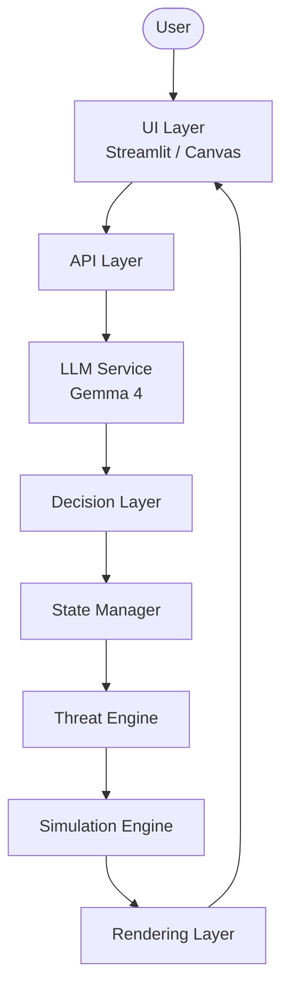
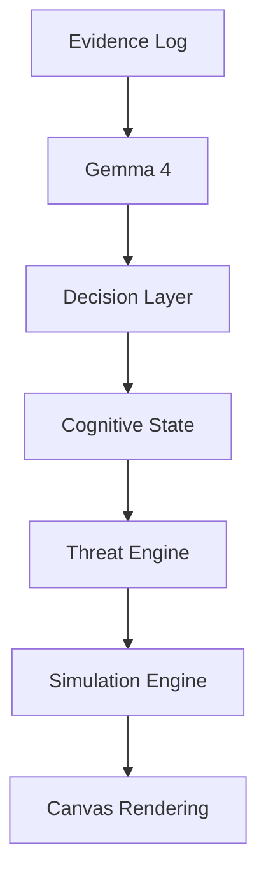
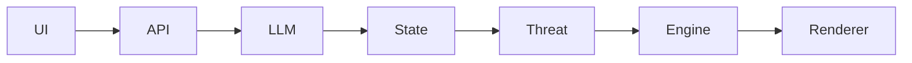

# Architecture

# Inference Collapse: Real-Time Hallucination Audit System

## Overview

**Inference Collapse** は、

**「LLMの認知状態がゲーム世界を書き換える」**

ことを目的とした実験的シミュレーションシステムです。

一般的な

```
LLM → Text Generation → UI
```

ではなく、

```
LLM → Cognitive State → Physics → World
```

という変換パイプラインを採用しています。

LLMは文章を生成するだけではなく、ゲーム世界を変化させる状態変数を生成します。

---

# Overall Architecture



システムは各レイヤーを責務ごとに分離し、State Managerを中心として疎結合に接続されています。

---

# Project Structure

```text
app.py

api/
 └── inference.py

services/
 └── gemma.py

state/
 ├── world_state.py
 ├── ai_state.py
 └── meta_state.py

engine/
 ├── threat.py
 └── simulation.py

ui/
 └── canvas.js

docs/
 ├── architecture.md
 ├── flow.md
 └── adr/
      ├── 001-separation-of-llm.md
      ├── 002-state-isolation.md
      └── 003-real-time-simulation.md
```

この構造により、

* LLM
* State
* Simulation
* UI

をそれぞれ独立した責務として管理できます。

---

# Component Responsibilities

## UI Layer

### Responsibility

* ユーザー入力
* Canvas描画
* HUD表示
* ステータス表示

### Should NOT

* AI推論
* ゲームロジック
* 状態管理

---

## API Layer

### Responsibility

* UIとバックエンドの橋渡し
* 推論API呼び出し
* 状態更新API

### Should NOT

* 描画
* シミュレーション
* AIロジック

---

## LLM Service

### Responsibility

* セキュリティログ解析
* 推論生成
* JSON構造化

### Output

```json
{
  "report": "...",
  "confidence": 0.87,
  "severity": 4,
  "contradiction": false
}
```

LLMは**真実生成装置**ではなく、

**認知状態生成器（Cognitive State Generator）**

として扱います。

---

## Decision Layer

### Responsibility

LLMの出力をゲームエンジンが扱える形式へ正規化します。

### Input

* confidence
* severity
* contradiction

### Output

* normalized confidence
* threat value
* entropy

この層を設けることで、LLMとゲームエンジンを直接結合しない設計になっています。

---

## State Manager

### Responsibility

ゲーム全体の状態を保持する唯一の管理層です。

### Managed States

* WorldState
* AIState
* MetaState

### Should NOT

* 描画
* AI推論
* 物理演算

Stateはゲーム全体の共有データとして利用されます。

---

## Threat Engine

### Responsibility

AIの認知状態をゲーム世界の物理法則へ変換します。

### Input

* confidence
* severity
* contradiction
* hallucination

### Output

* Enemy Speed
* Field of View (FOV)
* Detection Range
* Glitch Effect

このシステム最大の特徴であり、

**AIの認知状態が物理法則になります。**

---

## Simulation Engine

### Responsibility

ゲーム世界をリアルタイムに更新します。

### Controls

* Player
* Enemy AI
* Collision
* Physics
* Timer
* Environment

Threat Engineから渡された値のみを利用してゲーム世界を更新します。

---

## Rendering Layer

### Responsibility

現在の世界状態を描画します。

### Technology

* HTML5 Canvas
* JavaScript

担当するもの

* 視界
* HUD
* グリッチ演出
* エフェクト

---

# Data Flow

推論がゲームへ反映されるまでの流れです。



この流れにより、

**LLMの認知結果がゲーム世界へ反映されます。**

---

# Design Principles

本プロジェクトは以下の設計原則に基づいています。

## Prototype First

まず動くものを作り、

後から構造化します。

---

## Post-Hoc Architecture

最初に設計するのではなく、

**実装から設計を抽出する**

アプローチを採用しています。

---

## Inference-to-Physics Mapping

LLMの認知状態を、

ゲーム世界の物理法則へ変換します。

| LLM Output    | Physics       |
| ------------- | ------------- |
| Confidence    | Enemy Speed   |
| Severity      | Glitch Effect |
| Contradiction | Entropy       |
| Hallucination | FOV           |

---

# Design Goals

本システムの設計目標は以下です。

* Responsibility Separation（責務分離）
* Loose Coupling（疎結合）
* Replaceable LLM
* Replaceable Game Engine
* Replaceable UI
* Backend Migration Ready
* Scalable Architecture

---

# Future Extensions

今後予定している拡張です。

* Decision Layerの完全分離
* FastAPI Backend
* WebSocket同期
* Multi-Agent LLM
* Cognitive State Visualizer
* Save / Replay System

---

# Related Documents

| Document                          | Purpose          |
| --------------------------------- | ---------------- |
| `README.md`                       | プロジェクト概要         |
| `flow.md`                         | システム全体の処理フロー     |
| `adr/001-separation-of-llm.md`    | LLM分離の設計判断       |
| `adr/002-state-isolation.md`      | State管理の設計判断     |
| `adr/003-real-time-simulation.md` | リアルタイムシミュレーション設計 |

---

# Conclusion

Inference Collapse は単なるゲームではありません。

**LLMの認知状態をゲーム世界の物理法則へ変換する実験システム**です。

本プロジェクトでは、

* 推論から物理法則への変換
* 認知状態の可視化
* 後付けアーキテクチャ設計

を中核コンセプトとして設計されています。

# Key Design Decisions

## Overview

ここで説明するのは「どのように実装したか」ではなく、

**なぜその設計を選択したのか**

という意思決定の理由です。

---

# Design Decision 1

## Prototype First

### Decision

初期段階では、アーキテクチャの完成度よりも**動作するプロトタイプ**を優先しました。

### Reason

コンテスト期間という時間的制約の中で、最優先事項は

> **「AI の推論結果がリアルタイムでゲーム世界に影響する体験」を成立させること**

でした。

責務分離やAPI設計を先に行うと、開発速度が大きく低下し、コアアイデアの検証が難しくなるため、まずは統合型プロトタイプを採用しました。

### Trade-off

**メリット**

* 高速な試作
* アイデア検証が容易
* ユーザー体験を早期に確認できる

**デメリット**

* 密結合
* 状態管理の複雑化
* 拡張性の低下

---

# Design Decision 2

## Separate AI from Simulation

### Decision

LLM と Simulation Engine を直接接続せず、State Manager と Threat Engine を介して連携します。

### Reason

LLM は非決定的な推論を行います。

一方、Simulation Engine は毎フレーム決定的に動作する必要があります。

両者を直接結合すると、

* 再現性の低下
* デバッグの困難化
* フレーム更新の不安定化

を招くため、責務を分離しました。

### Result

Simulation Engine は AI の存在を意識せず、物理パラメータだけを扱います。

---

# Design Decision 3

## Centralized State Management

### Decision

ゲーム全体の状態は State Manager が一元管理します。

### Reason

LLM・UI・Engine がそれぞれ独自に状態を変更すると、

* 状態の整合性が失われる
* デバッグが困難になる
* 更新順序が不明確になる

ため、すべての状態更新を State Manager に集約しました。

### State Structure

```text
State

├── WorldState
├── CognitiveState
├── SimulationState
└── TelemetryState
```

これにより、状態の責務が明確になり、将来的な永続化やログ解析にも対応しやすくなります。

---

# Design Decision 4

## Introduce the Threat Engine

### Decision

LLM の出力をゲームへ直接反映せず、Threat Engine を経由して物理パラメータへ変換します。

### Reason

LLM の出力は意味情報であり、そのままゲームロジックに使用すると制御が困難になります。

そこで、

認知情報を一度「物理パラメータ」へ変換するレイヤーを設けました。

### Transformation Rules

| Cognitive State | Physical Effect       |
| --------------- | --------------------- |
| Confidence      | Enemy Speed           |
| Severity        | Spatial Instability   |
| Contradiction   | Perception Distortion |

これにより、

**AI の認知状態が世界の物理法則へ変換される**

という、本プロジェクト独自の設計が成立しています。

---

# Design Decision 5

## One-Way Data Flow

### Decision

データは常に一方向に流れる構造を採用しています。



### Reason

双方向依存を避けることで、

* デバッグが容易
* 依存関係が明確
* レイヤーごとの責務が独立

という利点があります。

---

# Design Decision 6

## Post-Hoc Architecture

### Decision

本プロジェクトでは、最初に設計を完成させるのではなく、

**動作するプロトタイプから設計を抽出する**

というアプローチを採用しました。

### Reason

本システムは、AI とゲームを統合した未知の設計領域を扱っています。

そのため、理論だけではなく、実際に動作するシステムから責務や境界を発見する方が適切だと判断しました。

### Result

最終的に、

* LLM Service
* State Manager
* Threat Engine
* Simulation Engine
* UI Layer

という責務ごとのアーキテクチャへ整理されました。

---

# Alternatives Considered

設計検討時には、以下の代替案も検討しました。

| Alternative             | Reason for Rejection |
| ----------------------- | -------------------- |
| LLM → Game Engine を直接接続 | AI とゲームロジックが密結合になる   |
| UI から State を直接更新       | 状態管理が分散し整合性を保てない     |
| 単一 State オブジェクト         | 神オブジェクト化し、拡張性が低下する   |
| Threat Engine を省略       | 認知情報と物理法則の境界が曖昧になる   |

---

# Conclusion

本プロジェクトの設計判断は、**プロトタイプの迅速な実現**と**将来的な拡張性**の両立を目指したものです。

そのため、単にコードを分割するのではなく、

* AI は認知を生成する
* State は世界を記録する
* Threat Engine は認知を物理法則へ変換する
* Simulation Engine は物理世界を更新する
* UI は世界を観測・表示する

という責務を明確に分離しました。

この設計により、LLM の変更や新機能の追加を、他レイヤーへの影響を最小限に抑えながら行える、拡張性の高いアーキテクチャを実現しています。

