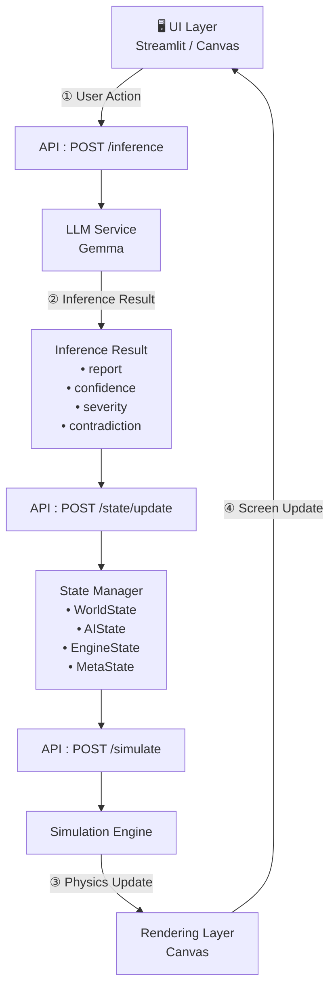
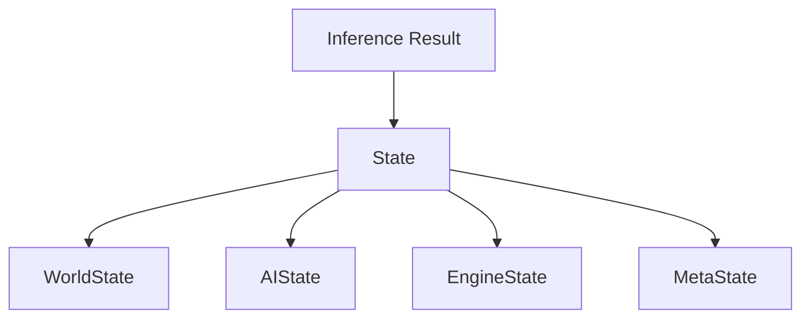
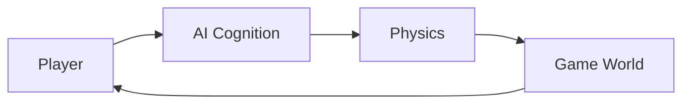

# Flow

## システム処理フロー

このドキュメントでは、ユーザーの入力からゲーム世界へ反映されるまでの一連のデータフローを説明します。

Inference Collapse は、

**AIの認知状態をゲーム世界の物理法則へ変換する**

ことを目的としたシステムです。

---

# Overall Flow



システム全体は

**UI → API → LLM → State → Engine → Render**

という一方向のデータフローを採用しています。

---

# 1. User Action Layer

プレイヤーが世界へ干渉する唯一の入口です。

## 入力例

* Evidence（証拠）
* 調査対象
* ボタン操作
* コマンド入力

UIは入力と表示のみを担当し、ゲームロジックは持ちません。

---

# 2. Cognition Layer（LLM）

LLMが証拠を解析し、世界を解釈します。

## 主な役割

* 推論生成
* 危険度評価
* 矛盾検出
* 確信度推定

出力例

```json
{
  "report": "...",
  "confidence": 0.91,
  "severity": 0.72,
  "contradiction": false
}
```

重要なのは、

**LLMはゲームを操作しない**

という点です。

あくまで「認知状態」を生成するだけです。

---

# 3. State Update Layer

LLMの結果を世界の状態として保存します。



## Stateの責務

### WorldState

ゲーム世界の状態

### AIState

推論結果・認知状態

### EngineState

物理シミュレーション用データ

### MetaState

ログ・履歴

この層を経由することで、LLMとゲームエンジンを疎結合に保ちます。

---

# 4. Physics Layer

Simulation Engine は現在の State を読み取り、

ゲーム世界を更新します。

代表的な変換ルールは以下です。

| AI State      | Physics       |
| ------------- | ------------- |
| Confidence    | Enemy Speed   |
| Severity      | Glitch Effect |
| Hallucination | Field of View |
| Contradiction | Entropy       |

つまり、

**AIの認知状態がゲーム世界の物理法則になります。**

---

# 5. Rendering Layer

Simulation Engine が更新した世界を描画します。

描画対象

* Canvas
* HUD
* グリッチエフェクト
* 視界（FOV）
* ステータス表示

Rendering Layer は描画のみを担当し、ゲームロジックは持ちません。

---

# Core Loop

Inference Collapse の本質は次のループにあります。



つまり、

> **AIの認知 → 物理法則 → 世界 → プレイヤー体験**

という循環構造になっています。

従来のゲームでは、

```text
Difficulty = Fixed Parameter
```

ですが、本システムでは、

```text
Difficulty = AI Cognitive State
```

となります。

---

# Architectural Constraints

システムの保守性を維持するため、以下の構造は禁止します。

❌ 禁止

```text
LLM → Game Engine

UI → State

JavaScript → AI State
```

これらは

* 再現性の低下
* デバッグ困難
* 責務の混在

を引き起こします。

---

# Required Flow

必ず以下の一方向フローを維持します。

```text
UI
 ↓
API
 ↓
LLM
 ↓
State
 ↓
Simulation Engine
 ↓
Rendering
```

これにより各コンポーネントは独立性を維持できます。

---

# Design Philosophy

このシステムはゲームではありません。

**AIの認知状態が物理現象へ変換される過程を観測する実験システム**です。

各コンポーネントは次の役割を持ちます。

| Component         | Role                             |
| ----------------- | -------------------------------- |
| LLM               | 思考（Cognition）                    |
| State             | 記憶（Memory）                       |
| Simulation Engine | 物理法則（Physics）                    |
| Rendering         | 可視化（Visualization）               |
| UI                | 観測・操作（Observation & Interaction） |

---

# Future Evolution

現在のフローは最小構成ですが、将来的には以下へ発展可能です。

* Async Inference
* Event-Driven State Updates
* Distributed Simulation Engine
* WebSocket Synchronization
* Multi-Agent LLM Environment

現在の設計は、それらへ拡張できるコアアーキテクチャとして設計されています。
