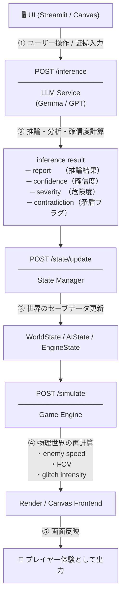

```mermaid
flowchart TD
    UI["🖥️ UI (Streamlit / Canvas)"]

    UI -->|"① ユーザー操作 / 証拠入力"| INF

    INF["POST /inference\n─────────────────\nLLM Service\n(Gemma / GPT)"]

    INF -->|"② 推論・分析・確信度計算"| RESULT

    RESULT["inference result
    ─ report　　（推論結果）
    ─ confidence（確信度）
    ─ severity　（危険度）
    ─ contradiction（矛盾フラグ）"]

    RESULT --> STATE_EP

    STATE_EP["POST /state/update\n─────────────────\nState Manager"]

    STATE_EP -->|"③ 世界のセーブデータ更新"| WORLD

    WORLD["WorldState / AIState / EngineState"]

    WORLD --> SIM_EP

    SIM_EP["POST /simulate\n─────────────────\nGame Engine"]

    SIM_EP -->|"④ 物理世界の再計算\n・enemy speed\n・FOV\n・glitch intensity"| RENDER

    RENDER["Render / Canvas Frontend"]

    RENDER -->|"⑤ 画面反映"| OUT

    OUT["🎨 プレイヤー体験として出力"]
```
