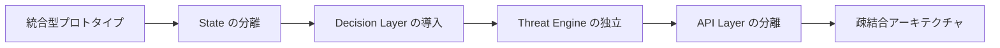

# Problem Statement

## なぜ問題が発生したのか

本ドキュメントでは、本プロジェクトで発生した構造的な課題と、その背景にある設計上の意図を説明する。

これらの問題は実装ミスではなく、**プロトタイプを短期間で成立させるために意図的に選択したトレードオフ**である。

---

# 1. プロトタイプ優先の設計

本プロジェクトはコンテスト期間という制約の中で、

**「LLM の推論結果をリアルタイムでゲーム世界へ反映する」**

ことを最優先として開発を開始した。

初期段階では、次のようなシンプルな構造を採用している。

```text
LLM
   │
   ▼
JSON
   │
   ▼
Game State
   │
   ▼
Game Engine
   │
   ▼
UI
```

この構造は厳密なアーキテクチャとしては理想的ではないが、当時の目的に対しては合理的な選択だった。

### 採用した理由

- LLMの出力を即座にゲームへ反映したかった
- 「AIが世界を書き換える」という体験を最優先したかった
- UI・AI・ゲームロジックを分離すると開発速度が大きく低下するため

つまり初期段階では、

**「正しい設計」よりも「現象を成立させること」**

を優先していた。

---

# 2. 発生した構造的課題

プロトタイプとしては目的を達成した一方で、システムとしては複数の構造的な課題が明らかになった。

---

## 2.1 LLM出力とゲームロジックの直結

LLMの推論結果が、そのままゲーム世界へ反映されていた。

```text
LLM
   │
   ▼
Game Engine
```

この構造では、

- 再現性が低い
- デバッグが困難
- ノイズとゲームロジックの境界が曖昧

という問題が発生する。

特に **confidence** や **severity** が直接ゲーム挙動へ影響するため、原因の追跡が難しくなる。

---

## 2.2 State の肥大化（神オブジェクト化）

すべての情報が単一の State に集約されていた。

```text
State
├── 世界状態
├── AI推論
├── Threat
├── ログ
├── UI状態
└── その他
```

その結果、

- 責務が曖昧になる
- 依存関係が複雑になる
- 修正の影響範囲が予測しにくい

という典型的な「神オブジェクト問題」が発生した。

---

## 2.3 Threat System の意味が曖昧

Threat System はゲーム内では機能していたものの、

- 難易度調整
- 演出
- 物理法則

という複数の役割を同時に担っていた。

そのため、

**「なぜこの値が世界を変えているのか」**

を設計として説明しづらい状態だった。

---

## 2.4 レイヤー間の密結合

現在のプロトタイプでは、

```text
Streamlit
     │
     ▼
Python Backend
     │
 ┌───┼────┐
 ▼   ▼    ▼
LLM State Engine
```

のように、各コンポーネントが直接接続されている。

この構造では、

- レイヤー分離が不十分
- 修正の影響範囲が広い
- 将来的な拡張が難しい

という課題がある。

---

# 3. 問題の本質

これらは偶然発生したバグではない。

本質的には、

**「スピードを優先した統合型プロトタイプの限界」**

である。

つまり、

- AI
- 状態管理
- シミュレーション
- UI

を一体化したことで、短期間で体験を実現できた一方、構造的な複雑さが増大した。

---

# 4. 解決方針

本プロジェクトでは、段階的に構造を改善する方針を採用している。



改善の方向性は次のとおりである。

- State を責務ごとに分割する
- Decision Layer を導入する
- Threat Engine を独立した物理変換層とする
- API Layer を明確に分離する
- UI・Engine・LLM の依存を最小化する

---

# 5. 結論

本プロジェクトで発生した課題は、設計ミスではなく、

**「AI とゲームを最短で統合するために意図的に選択したトレードオフ」**

によって生じた構造的な限界である。

本プロジェクトは、

1. プロトタイプで現象を成立させる
2. 問題を構造として分析する
3. 段階的に責務を分離する

というプロセスを経て、

**実験的なプロトタイプから、拡張可能なアーキテクチャへ発展させることを目指している。**
